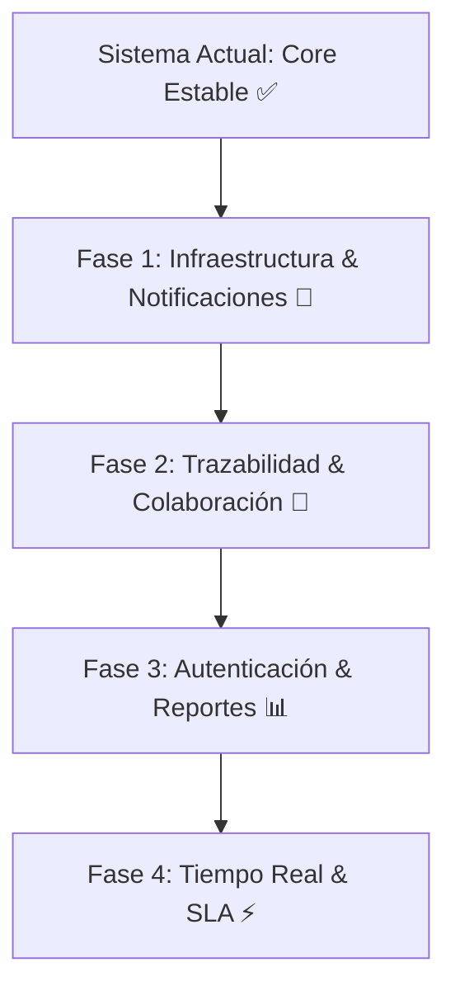

# 📋 Roadmap & TO-DO: Próximas Mejoras del Sistema de Tickets

Este documento detalla las funcionalidades, mejoras arquitectónicas y optimizaciones recomendadas para evolucionar el sistema de tickets hacia una plataforma de gestión completa de nivel empresarial.

---

## 🎯 Resumen de Prioridades



---

## 🚀 Fase 1: Despliegue y Notificaciones (Alta Prioridad)

### 1. 🐳 Dockerización Completa
- [ ] **`Dockerfile` optimizado**: Construcción multi-stage en Python 3.12 Alpine/Slim para reducir peso y consumo de RAM.
- [ ] **`docker-compose.yml`**: Orquestación de FastAPI + MongoDB + Mongo Express (interfaz gráfica de BD) para desarrollo local con 1 solo comando (`docker compose up`).
- [ ] **Configuración para Railway / Render**: Archivo `railway.json` o `render.yaml` con health check automático.

### 2. 📧 Notificaciones por Correo Electrónico (Background Tasks)
- [ ] **Confirmación de Creación**: Enviar correo automático al solicitante con el número identificador (`TCK-1001`), título y resumen.
- [ ] **Aviso al Técnico Asignado**: Notificar al técnico cuando se le asigne un nuevo ticket.
- [ ] **Resolución de Ticket**: Notificar al solicitante cuando su ticket pase a estado `resuelto` o `cerrado`.
- [ ] **Tecnología recomendada**: FastAPI `BackgroundTasks` con proveedor SMTP o API moderna (Resend / SendGrid / Brevo).

---

## 💬 Fase 2: Trazabilidad y Colaboración (Media Prioridad)

### 3. 📝 Comentarios y Notas Internas
- [ ] **Comentarios Públicos**: Intercambio de mensajes entre el solicitante y el técnico para pedir más información.
- [ ] **Notas Privadas (Internas)**: Apuntes visibles únicamente por el equipo de sistemas.
- [ ] **Adjuntos en Comentarios**: Capacidad de subir capturas adicionales dentro de los comentarios vía GridFS.

### 4. 📜 Historial de Auditoría (Audit Log)
- [ ] Registro cronológico de cambios en cada ticket:
  - *"Cambio de estado de 'abierto' a 'en_progreso' por Nicolas Gonzalez el 31/08/2026 16:30"*.
  - *"Prioridad modificada de 'media' a 'critica'"*.

---

## 📊 Fase 3: Gestión, Reportes y Seguridad

### 5. 📑 Exportación de Reportes (Excel / CSV / PDF)
- [ ] **`GET /api/v1/tickets/export/excel`**: Descarga de tickets filtrados en formato `.xlsx` con librerías como `openpyxl`.
- [ ] **`GET /api/v1/tickets/export/csv`**: Exportación liviana en CSV para análisis rápido.
- [ ] **Generación de Reporte PDF**: Comprobante de ticket individual en PDF imprimible.

### 6. 📈 Métricas y Dashboard para Administración
- [ ] **`GET /api/v1/tickets/metrics`**:
  - Tiempo promedio de resolución de tickets (SLA).
  - Cantidad de tickets por estado y por prioridad.
  - Rendimiento por técnico (tickets cerrados vs asignados).
  - Volumen de tickets por mes / semana.

### 7. 🔐 Autenticación y Control de Accesos (JWT & Roles)
- [ ] **Autenticación con JWT**: Login seguro para técnicos y administradores (`/api/v1/auth/login`).
- [ ] **Roles de Usuario**:
  - `admin`: Gestión total, creación de usuarios, configuración y reportes.
  - `tecnico`: Ver tickets asignados, cambiar estados y responder comentarios.
  - `public`: Creación de tickets y consulta por identificador.

---

## ⚡ Fase 4: Búsqueda Avanzada y Tiempo Real

### 8. 🔍 Búsqueda Full-Text en MongoDB
- [ ] Crear índices de texto (`$text`) en `titulo` y `descripcion`.
- [ ] Búsqueda por palabras clave con soporte de operadores o aproximaciones.

### 9. 🔔 Actualizaciones en Tiempo Real (WebSockets / SSE)
- [ ] **Server-Sent Events (SSE) o WebSockets**: Notificación instantánea en el panel de control o Kanban de técnicos cuando entra un nuevo ticket sin necesidad de hacer F5.

### 10. ⏱️ Control de SLA (Acuerdos de Nivel de Servicio)
- [ ] Configurar tiempos máximos de respuesta según prioridad:
  - *Crítica*: 2 horas.
  - *Alta*: 8 horas.
  - *Media*: 24 horas.
  - *Baja*: 48 horas.
- [ ] Alerta visual de ticket vencido o próximo a vencer.

---

## 📂 Estructura Sugerida para Futuras Implementaciones

```text
src/
├── core/
│   ├── email.py          # Cliente de envío de correos
│   ├── security.py       # Hashing de contraseñas y JWT
│   └── websockets.py     # Manager de conexiones en tiempo real
├── models/
│   ├── ticket_model.py
│   ├── comment_model.py  # Modelo para comentarios/notas
│   └── user_model.py     # Modelo para técnicos y administradores
├── services/
│   ├── export_service.py # Lógica de generación de Excel/PDF
│   └── stats_service.py  # Cálculo de métricas y SLA
```
